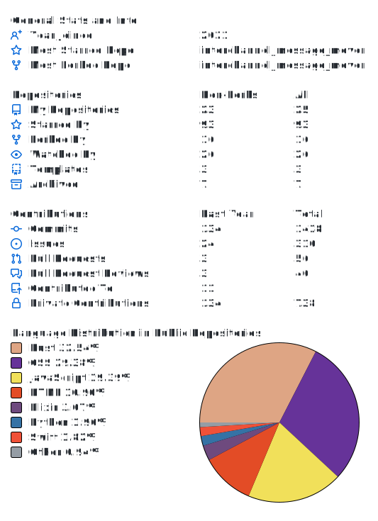
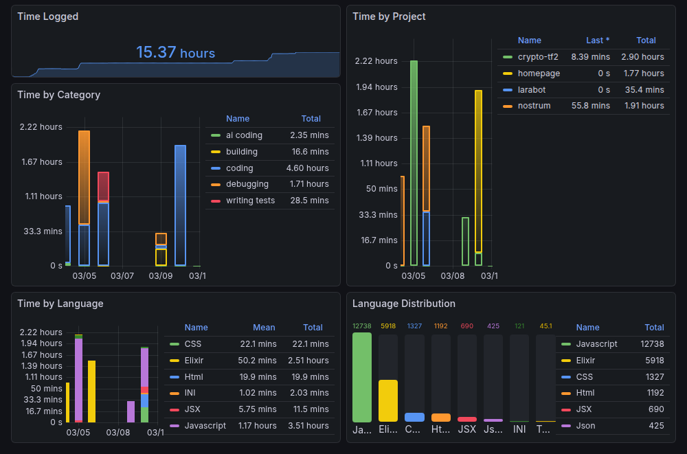

 

# hi there!

i'm **lara**, a 22 years old non-binary university student at [METU](https://metu.edu.tr) **coding whatever is my cup of tea**, nice to meet you.

<picture>
<source media="(prefers-color-scheme: dark)" srcset="stats-dark.svg" />

</picture>

<picture>
<source media="(prefers-color-scheme: dark)" srcset="snake-dark.svg" />

</picture>
 
 
<picture>

</picture>

## my coding activity <ins>second by second</ins>

*click on the image to **dive deeper***

---

## let's <ins>get in touch</ins>

---

## tools that <ins>make my day</ins>

___

## my programming journey <ins>so far</ins>

*check out **pinned respositories** for my open source work*

cooking up **some stuff** at [Robert Industries](https://github.com/robertindustries)

ex-developer at [sorter](https://github.com/sorterisntonline)

development team member of [Twilight](https://github.com/twilight-rs/twilight)

alumni HR responsible of [Board of European Students of Technology](https://best.eu.org) IT Department

past volunteer at [ÜNOG](https://unog.dev)

___

## some playlists <ins>for you</ins>

*why aren't my playlists on spotify? [**because**](https://boycottspotify.univer.se)*

  

___

❤️🧡💛💚💙💜💛🤍💜🖤

